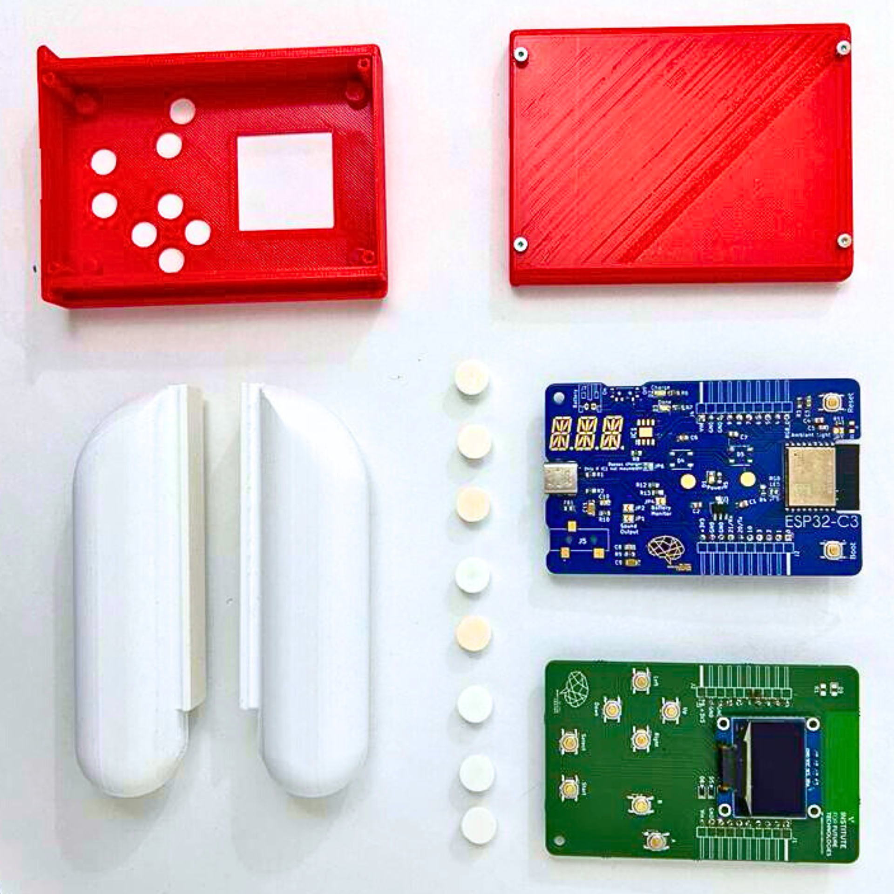
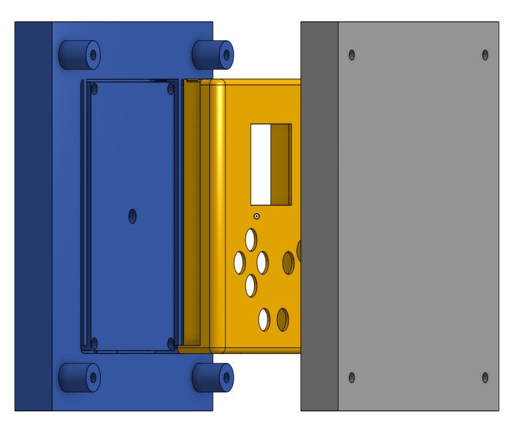

# Gamongus: A Wireless Multiplayer Gameboy

## Goals
This project was developed as part of the HMAE course in week 3 of the IFT program. The objective was to create, build, and code a wireless multiplayer Gameboy.

The project required the production of a box using the injection molding process, enabling two-player wireless gameplay.

### Video Demonstration
<p align="left">
  
</p>
<p align="right">
  
</p>

## Hardware Used
- 2 ESP32 DevModules
- 2 PCB shields equipped with buttons and an SSD1306 OLED Display
  <p align="center">
  
</p>

## Project Structure

The project is structured as follows:

- `WIFI_server_player1` and `WIFI_client_player2` files contain all the necessary code to flash the 2 ESP32 devices. One acts as a server, and the other as a client. Communication between the two ESP devices occurs over WiFi using the UDP protocol, chosen for its speed. A Pong game is implemented for the 2 Gamongus devices.

- The `3d` folder contains the molds used for injection printing the Gamongus box. The box design draws inspiration from Among Us aesthetics and the ergonomic design of the Nintendo Switch, featuring removable handles for improved handling.

<p align="center">
  
</p>

## Usage
These programs run on ESP32 web:

1. Modify the WIFI parameters in the `.ino` files by replacing `SSID` and `SSID_password` with your WiFi network's credentials.
```cpp
const char *ssid = "Your_SSID";
const char *password = "Your_Password";
```

2. Flash both ESP32 devices with the provided `.ino` code.

3. Turn on both Gamongus devices and wait a moment for them to connect to your WiFi network.

4. Start playing the implemented Pong game and challenge your opponent!

## Dependencies

- [Adafruit GFX Library](https://github.com/adafruit/Adafruit-GFX-Library)
- [Adafruit SSD1306 Library](https://github.com/adafruit/Adafruit_SSD1306)
- [Keypad Library](https://github.com/Chris--A/Keypad)

## Main Features

- WiFi Multiplayer: Allows two players to compete in real-time.
- Score Display: Each player's score is shown at the center of the screen.
- Automatic Client Discovery: The server sends a discovery request and retrieves the client's IP address.
- Ergonomic Box Design for comfortable and uninterrupted gaming sessions.

## Authors

This project was carried out by:
- Sébastien LAM
- Maëlle ROCHE
- Arthur SZANTYR


